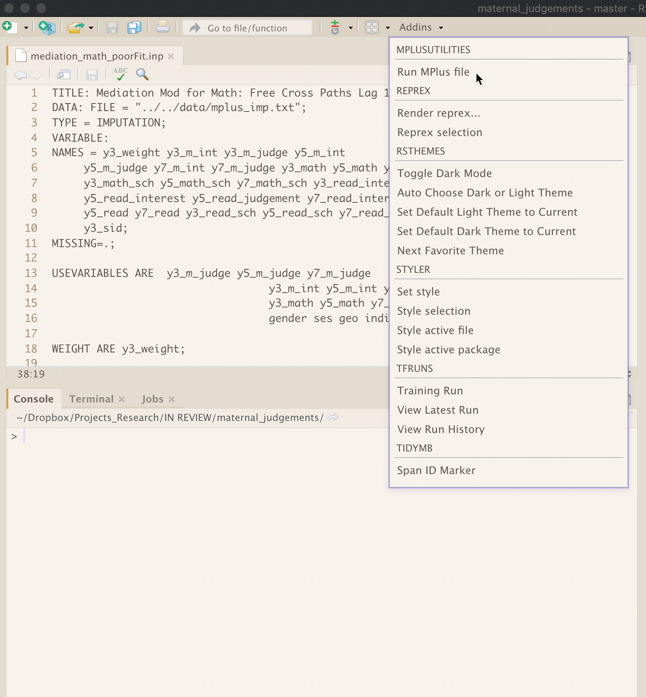

<!-- README.md is generated from README.Rmd. Please edit that file -->

# mplusUtilities

<!-- badges: start -->

[](https://CRAN.R-project.org/package=mplusUtilities)
[](https://www.tidyverse.org/lifecycle/#experimental)
<!-- badges: end -->

The goal of mplusUtilities is to add some of functionality present in
the MPlus package for [Sublimetext](https://github.com/bkeller2/Mplus).
So far I just have a single add-in that runs an mplus input file and
opens the output file after it finishes. The add in uses the
[MplusAutomation
package](https://github.com/michaelhallquist/MplusAutomation).



## Installation

Install from [GitHub](https://github.com/) with:

``` r
# install.packages("devtools")
devtools::install_github("pdparker/mplusUtilities")
```

## Useage

I imagine assigning the Run MPlus file add in to a keyboard shortcut
(e.g., cmd+b) as per Sublime text.
